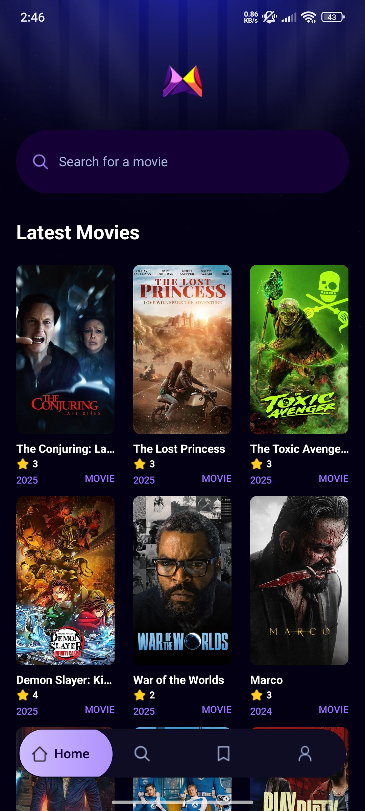
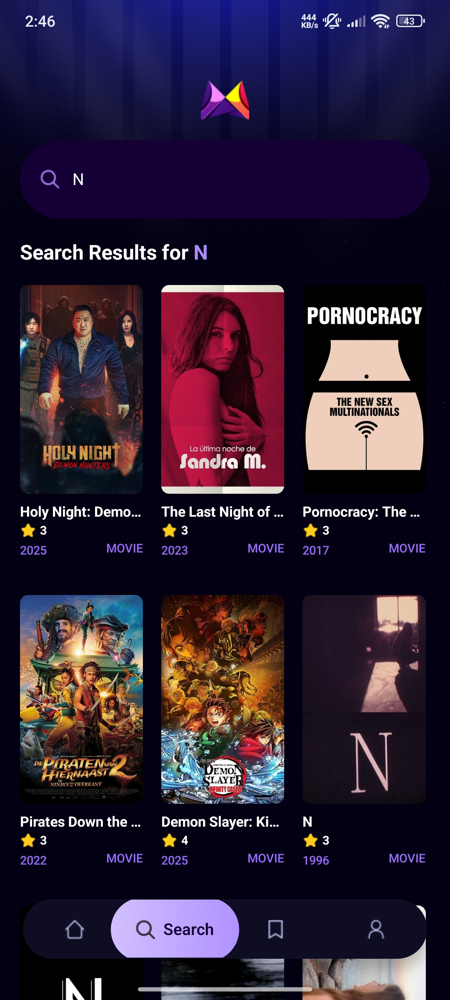
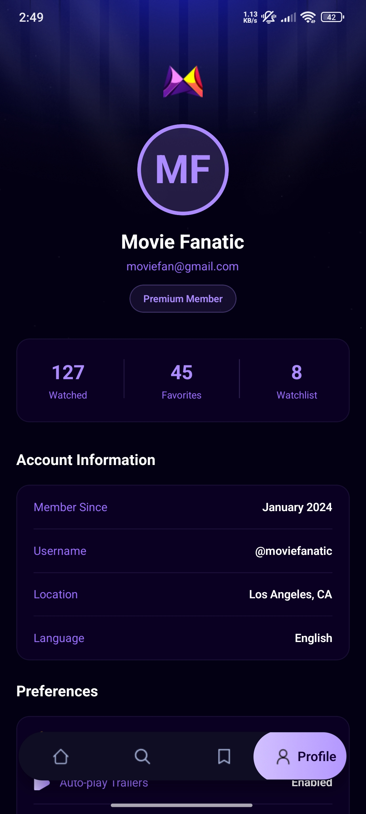
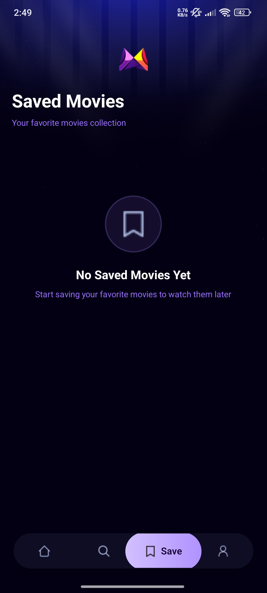

# 🎬 MovieFlex - React Native App

A beautiful and modern movie browsing application built with React Native, Expo Router, and NativeWind. Discover, search, and save your favorite movies with real-time data from TMDB API.

## ✨ Features

- 🏠 **Home Page**: Browse featured and discover latest movies
- 🔍 **Search Page**: Real-time search functionality with debouncing
- 💾 **Saved Movies**: Save and manage your favorite movies
- 👤 **Profile Page**: User profile with stats and preferences
- 📊 **Popularity Algorithm**: Track user searches to display trending movies
- 🎨 **Beautiful UI**: Modern dark purple theme with smooth animations
- ⚡ **Fast Performance**: Optimized with React Native and Expo SDK 54
- 📱 **Cross-Platform**: Works on iOS, Android, and Web

## 📸 Screenshots

<div align="center">

### Home Screen



### Search Screen



### Profile Screen



### Saved Movies



</div>

## 🚀 Tech Stack

- **Framework**: React Native with Expo SDK 54
- **Routing**: Expo Router (File-based routing)
- **Styling**: NativeWind (Tailwind CSS for React Native)
- **Language**: TypeScript
- **API**: The Movie Database (TMDB) API
- **Backend**: Appwrite (for saved movies and user data)
- **State Management**: React Hooks
- **UI Components**: Custom components with modern design

## 📋 Prerequisites

Before you begin, ensure you have the following installed:

- Node.js (v18 or higher)
- npm or yarn
- Expo Go app on your mobile device
- TMDB API key (get it from [TMDB](https://www.themoviedb.org/settings/api))
- Appwrite account (optional, for backend features)

## 🛠️ Installation

1. **Clone the repository**

   ```bash
   git clone https://github.com/bugsguruu/MovieFlex_Reactnative_App.git
   cd MovieFlix_ReactnativeApp
   ```
2. **Install dependencies**

   ```bash
   npm install
   ```
3. **Set up environment variables**

   Create a `.env` file in the root directory and add your API keys:

   ```env
   EXPO_PUBLIC_MOVIE_API_KEY=your_tmdb_api_key_here
   EXPO_PUBLIC_APPWRITE_PROJECT_ID=your_appwrite_project_id
   EXPO_PUBLIC_APPWRITE_PROJECT_NAME=your_project_name
   EXPO_PUBLIC_APPWRITE_ENDPOINT=https://cloud.appwrite.io/v1
   EXPO_PUBLIC_APPWRITE_DATABASE_ID=your_database_id
   EXPO_PUBLIC_APPWRITE_COLLECTION_ID=your_collection_id
   ```
4. **Start the development server**

   ```bash
   npx expo start
   ```
5. **Run the app**

   - Scan the QR code with **Expo Go** app (Android) or **Camera** app (iOS)
   - Press `a` for Android emulator
   - Press `i` for iOS simulator
   - Press `w` for web browser

## 📱 Running on Physical Device

1. Install **Expo Go** from:

   - [Google Play Store](https://play.google.com/store/apps/details?id=host.exp.exponent) (Android)
   - [App Store](https://apps.apple.com/app/expo-go/id982107779) (iOS)
2. Make sure your device is on the same network as your development machine
3. Scan the QR code displayed in the terminal after running `npx expo start`

## 🏗️ Project Structure

```
MovieFlix_ReactnativeApp/
├── app/                      # Main application code
│   ├── (tabs)/              # Tab-based navigation screens
│   │   ├── index.tsx        # Home screen
│   │   ├── search.tsx       # Search screen
│   │   ├── saved.tsx        # Saved movies screen
│   │   └── profile.tsx      # Profile screen
│   ├── movies/              # Movie details
│   │   └── [id].tsx         # Dynamic movie detail page
│   ├── _layout.tsx          # Root layout
│   └── global.css           # Global styles
├── components/              # Reusable components
│   ├── MovieCard.tsx        # Movie card component
│   └── SearchBar.tsx        # Search bar component
├── services/                # API and data fetching
│   ├── api.ts              # API service functions
│   └── useFetch.ts         # Custom fetch hook
├── constants/               # App constants
│   ├── icons.ts            # Icon exports
│   └── images.ts           # Image exports
├── interfaces/              # TypeScript interfaces
├── assets/                  # Static assets
│   ├── icons/
│   ├── images/
│   └── Screenshots/
└── package.json            # Dependencies
```

## 🎨 Color Theme

The app uses a beautiful dark purple theme:

- **Primary**: `#030014` - Deep space black
- **Secondary**: `#140034` - Dark purple
- **Accent**: `#AB8BFF` - Bright purple
- **Light shades**: `#D6C6FF`, `#B899FF`, `#9A6CFF`

## 📚 API Documentation

This app uses [The Movie Database (TMDB) API](https://developers.themoviedb.org/3) for fetching movie data.

### Available Endpoints:

- Get popular movies
- Search movies by keyword
- Get movie details
- Get movie ratings and reviews

## 🤝 Contributing

Contributions are welcome! Please feel free to submit a Pull Request.

1. Fork the project
2. Create your feature branch (`git checkout -b feature/AmazingFeature`)
3. Commit your changes (`git commit -m 'Add some AmazingFeature'`)
4. Push to the branch (`git push origin feature/AmazingFeature`)
5. Open a Pull Request

## 📄 License

This project is licensed under the MIT License - see the [LICENSE](LICENSE) file for details.

## 👨‍💻 Author

**bugsguruu**

- GitHub: [@bugsguruu](https://github.com/bugsguruu)
- Email: Bugs.guruu@gmail.com

## 🙏 Acknowledgments

- [Expo](https://expo.dev) for the amazing framework
- [TMDB](https://www.themoviedb.org) for the movie database API
- [NativeWind](https://www.nativewind.dev/) for Tailwind CSS support
- [Appwrite](https://appwrite.io/) for backend services

## 📞 Support

If you have any questions or need help, feel free to:

- Open an issue on GitHub
- Contact me via email

---

Made with ❤️ by bugsguruu
